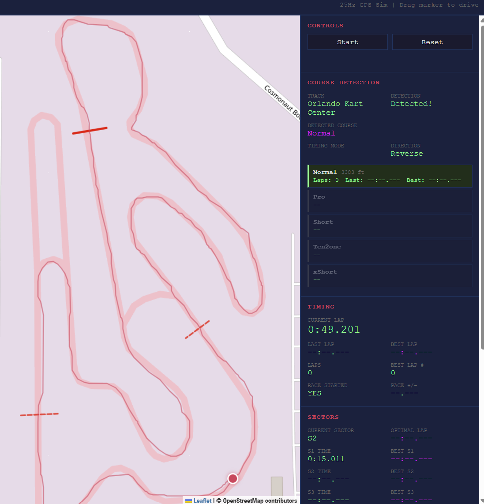

# DovesLapTimer Simulator

A web-based GPS datalogger simulator for developing and testing the [DovesLapTimer](https://github.com/TheAngryRaven/DovesLapTimer) library. The C++ library has been ported to JavaScript for rapid feature iteration — everything in `js/lib/` gets ported back to C++ when done.

## Quick Start

```
python -m http.server 8080
```

Open `http://localhost:8080`. No build step, no npm, no dependencies to install.

## What It Does

- Simulates 25Hz GPS data by dragging a marker on a Leaflet map
- Runs the full DovesLapTimer crossing detection and timing pipeline
- Supports multiple course layouts per track with automatic course detection
- Exports `.dove` CSV log files compatible with the [DovesDataLogger](https://github.com/TheAngryRaven/DovesDataLogger) data viewer

## Usage

1. Click **Start** to begin the 25Hz simulation
2. Drag the red marker around the map — it leaves a trail as you go
3. Cross the start/finish line to begin timing
4. Cross sector lines to record split times
5. Click **Stop** to end the session and download the `.dove` log file
6. Click **Reset** to clear all data and trails

### Course Detection

When a track has multiple course layouts (like Orlando Kart Center's Normal, Pro, Short, etc.), the simulator runs all courses simultaneously and auto-detects which one you're on:

1. All course lines appear on the map in different colors
2. When you reach 20+ mph, a blue waypoint blip is placed
3. Complete a lap back past the waypoint
4. The driven distance is compared to each course's known length
5. The closest match is selected, other courses are removed

### Track Data

Paste track JSON in the sidebar textarea and click **Apply**. Format matches the DovesDataLogger SD card files:

```json
{
  "longName": "Orlando Kart Center",
  "shortName": "OKC",
  "courses": [
    {
      "name": "Normal",
      "lengthFt": 3383,
      "start_a_lat": 28.4127, "start_a_lng": -81.3797,
      "start_b_lat": 28.4127, "start_b_lng": -81.3795,
      "sector_2_a_lat": ..., "sector_2_a_lng": ...,
      "sector_2_b_lat": ..., "sector_2_b_lng": ...,
      "sector_3_a_lat": ..., "sector_3_a_lng": ...,
      "sector_3_b_lat": ..., "sector_3_b_lng": ...
    }
  ]
}
```

Sector lines are optional. `lengthFt` is required for course detection.

## Project Structure

```
js/lib/     → THE LIBRARY (ported back to C++)
js/sim/     → GPS simulator, track data, session logger
js/ui/      → Leaflet map, data display, controls
js/app.js   → Wires everything together
```

See [CLAUDE.md](CLAUDE.md) for full architecture details and C++ port-back notes.

## Related

- [DovesLapTimer](https://github.com/TheAngryRaven/DovesLapTimer) — C++ GPS lap timing library (v3.1.1)
- [DovesDataLogger](https://github.com/TheAngryRaven/DovesDataLogger) — Arduino hardware datalogger


